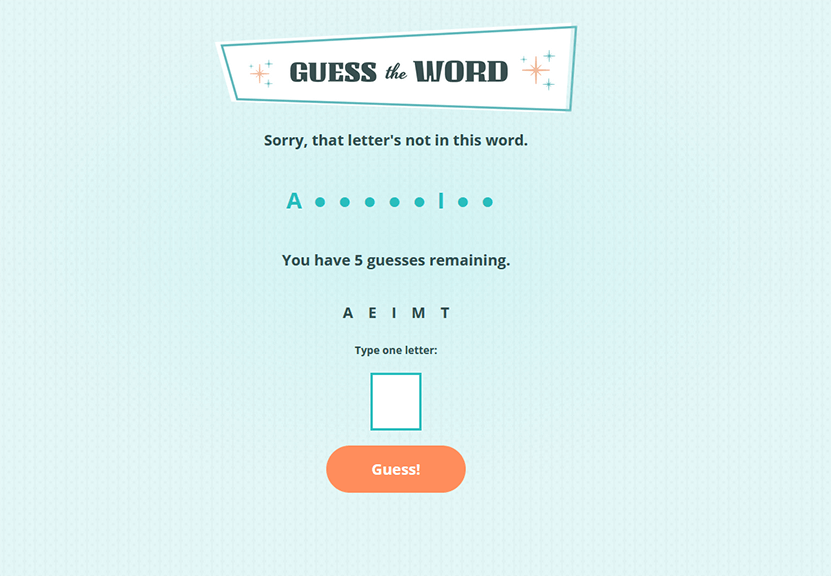

# Skillcrush - Guess the Word Game

This is the code to the [Skillcrush Guess the Word Game](https://learn.skillcrush.com). 

## Table of contents

- [Overview](#overview)
  - [The project](#the-project)
  - [Screenshot](#screenshot)
  - [Links](#links)
- [My process](#my-process)
  - [Built with](#built-with)
  - [What I learned](#what-i-learned)
- [Author](#author)

## Overview

### The project

Users should be able to:

- Play the working game any number of times, with a unique word each time
- Know which letters they've guessed are correct and which ones are incorrect
- Watch their word being built out in real time

### Screenshot



### Links

- Code URL: [https://github.com/amidona/guess-the-word](https://github.com/amidona/guess-the-word)
- Live Site URL: [https://amidona.github.io/guess-the-word/](https://amidona.github.io/guess-the-word/)

## My process

### Built with

- Vanilla JavaScript, especially:
    - APIs
    - Arrays
- Semantic HTML5 markup (provided by Skillcrush)
- CSS custom properties (provided by Skillcrush)

### What I learned

This project solidified a lot of learning. I figured out how to use APIs to grab a random word:

```js
const getWord = async function () {
    const request = await fetch("https://gist.githubusercontent.com/skillcrush-curriculum/7061f1d4d3d5bfe47efbfbcfe42bf57e/raw/5ffc447694486e7dea686f34a6c085ae371b43fe/words.txt");
    const data = await request.text();
    const wordArray = data.split("\n");
    const randomIndex = Math.floor(Math.random() * wordArray.length);
    word = wordArray[randomIndex].trim();
    blankWord(word);
};

getWord();
```
This project relies heavily on arrays, and I learned how to replace the letters in an array with a placeholder token and then later reveal the appropriate letter(s) as the user guesses them:

```js
//function to create the circles that stand-in for the word being guessed
const blankWord = function (word) {
    const lettersArray = [];
    for (const letter of word) {
        lettersArray.push("●");
    };
    currentWord.innerText = lettersArray.join("");
};

//function to replace the circles with the correct letter as they're guessed
const updateWord = function (guessedLetters) {
    const wordUpper = word.toUpperCase();
    const wordArray = wordUpper.split("");
    const revealLetter = [];
    for (const letter of wordArray) {
        if (guessedLetters.includes(letter)) {
            revealLetter.push(letter.toUpperCase());
        } else {
            revealLetter.push("●");
        }
    }
    currentWord.innerText = revealLetter.join("");
    checkWin();
};
```

## Author

- Website - [Allyce Amidon](https://allyceamidon.com/)
- GitHub - [@amidona](https://github.com/amidona)
